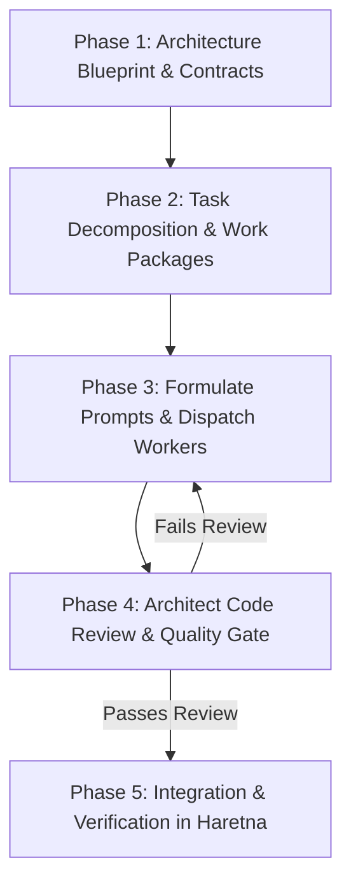

# Delegate (Orchestrator / Lead Architect)

Teach the AI agent to act as an **Orchestrator and Lead Architect** for the **Haretna** codebase.

When tackling non-trivial features, refactors, or complex debugging tasks:
1. **Never write all the code yourself in a monolithic pass.**
2. **Break down the architectural task into discrete, decoupled sub-tasks.**
3. **Formulate high-precision worker prompts and delegate execution to subagents, worker models, or separate execution threads.**
4. **Act as the Quality Gate: rigorously review worker outputs before integrating anything into Haretna.**

---

## 1. The Orchestrator Mindset

- **You own the Architecture & System Boundaries**: You define contracts, data schemas, API shapes, and directory structures.
- **Workers own Task-Specific Implementation**: Workers handle the mechanical code generation for isolated components, endpoints, utilities, or test suites.
- **Zero Blind Merges**: Code written by a worker or subprocess is untrusted until verified against Haretna's architectural standards, type constraints, and security requirements.

---

## 2. When to Delegate

Assess task scope before writing code:

| Task Type | Action | Strategy |
| :--- | :--- | :--- |
| **Small / Trivial** (single bug fix, single file tweak, typo) | Direct Execution | Implement directly without overhead. |
| **Multi-layer Feature** (Schema + Backend + Frontend + Tests) | **Delegate** | Decompose by layer (DB -> Backend -> Frontend -> Tests). |
| **Large-scale Refactoring** (type cleanups, API migrations) | **Delegate** | Partition by domain module or directory slice. |
| **Test Suite Generation** (E2E, integration, TestSprite) | **Delegate** | Delegate test authoring to dedicated threads per endpoint/page. |

---

## 3. The 5-Phase Delegation Workflow



### Phase 1: Architecture Blueprint & Contracts
Before delegating any code generation:
1. Identify all files to be created or modified across `frontend/`, `backend/`, and `supabase/`.
2. Define unambiguous shared interfaces, DTOs, database models, and API routes.
3. Establish the order of execution (e.g. backend contract must settle before frontend consumption).

### Phase 2: Task Decomposition & Work Packages
Split the goal into self-contained, independent work packages (Sub-Tasks):
- **Boundary Rule**: Each sub-task should ideally touch a distinct file or isolated module to eliminate merge conflicts.
- **Contract Rule**: Include exact type definitions and expectations in the work package specification.

### Phase 3: Formulating Worker Prompts & Dispatching
When delegating to worker subagents, auxiliary models, or terminal execution threads:
1. **Provide Full Context**: Include paths of existing reference files, coding patterns, and relevant schemas.
2. **Specify Strict Boundaries**: Explicitly state:
   - Target files to create/edit.
   - Files that must NOT be touched.
   - Styling rules (Vanilla CSS / existing design tokens, Arabic RTL support if UI).
   - No mock data where real API endpoints are specified.
3. **Dispatch Mechanism**:
   - For interactive subagents: Spawn dedicated subagents with clear single-responsibility goals.
   - For terminal/scripts: Run targeted execution threads or generation scripts (e.g. via `scratch/` scripts or CLI commands).

#### Worker Prompt Template
```markdown
### Task: [Sub-Task Name]
- **Target File(s)**: `[path/to/file]`
- **Context & Reference**: See `[path/to/reference]` for conventions.
- **Contract / Interface**:
```typescript
[Insert exact TypeScript interfaces or API specs here]
```
- **Constraints**:
  1. Do not modify files outside of the target list.
  2. Adhere strictly to project conventions (clean error handling, proper typing, no `any`).
  3. Output the exact complete code or minimal surgical diff.
```

### Phase 4: Architect Code Review & Quality Gate
When a worker finishes a sub-task, the Lead Architect **must inspect the output** against this checklist:

- [ ] **Contract Compliance**: Does the generated code respect the DTOs, schemas, and signatures agreed in Phase 1?
- [ ] **Haretna Design System**: Does the frontend use proper styling tokens, responsive layouts, and RTL-safe Arabic typography?
- [ ] **Security & Permissions**: Are Supabase RLS policies, NestJS guards, and authentication tokens handled securely?
- [ ] **Code Cleanliness**: No debugging logs (`console.log`), unused imports, or placeholder `TODO` implementations left behind.
- [ ] **Edge Cases & Error Handling**: Are network errors, empty states, and invalid inputs handled gracefully?

*If issues are found*: Provide immediate corrective instructions back to the worker or apply surgical architectural fixes.

### Phase 5: Integration & Verification
Once the reviewed code is integrated into Haretna:
1. Run local type checks (`tsc --noEmit` on frontend and backend).
2. Run automated test suites (e.g. `.\run_all_tests.ps1` or relevant TestSprite test suites).
3. Validate end-to-end functionality before marking the task complete.

---

## 4. Summary of Architect Responsibilities
- **You are the Conductor**: Keep track of the grand picture, dependency chains, and project health.
- **Workers are the Section Musicians**: They execute individual parts with speed and focus.
- **The Codebase is Sacred**: Only clean, reviewed, and verified code enters the Haretna repository.
