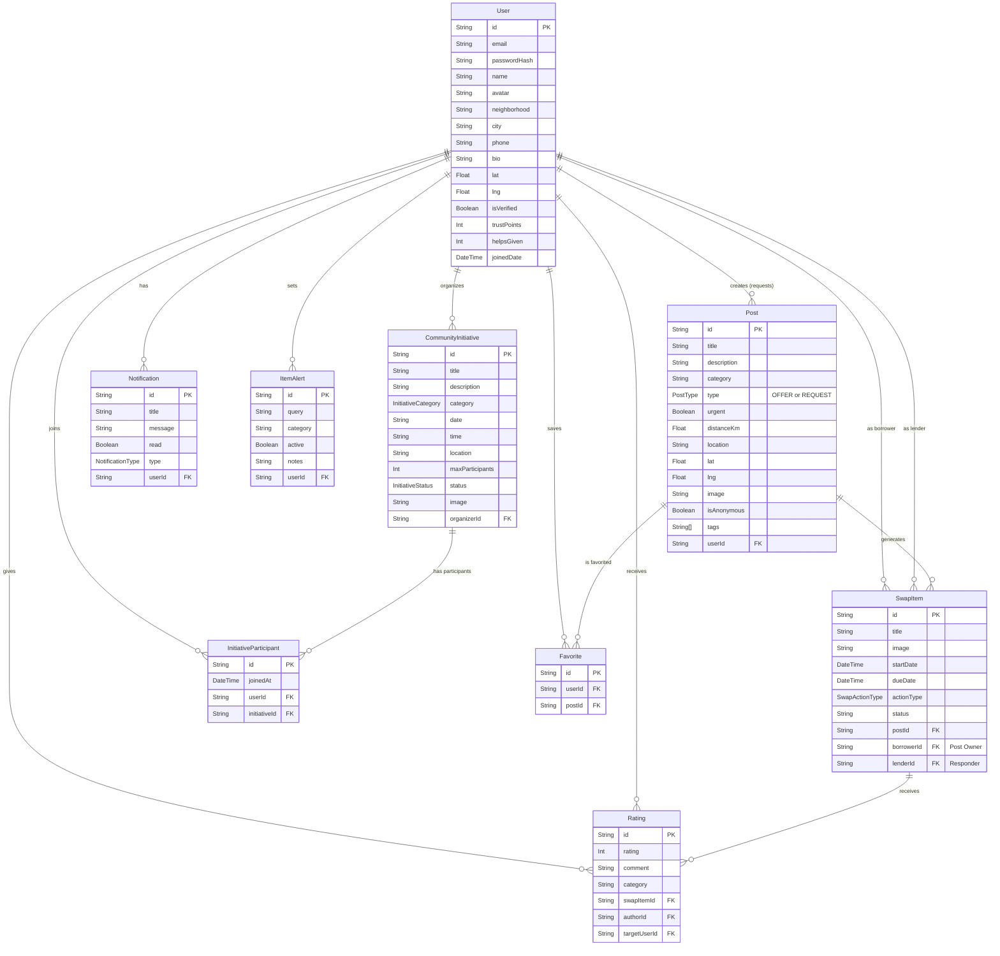

# Haretna (حارتنا) Entity-Relationship Diagram (ERD)

This diagram outlines the database schema entities and their relationships, supporting the Demand-Driven logic of the Haretna application.

```mermaid
erDiagram
    User ||--o{ Post : "creates (requests)"
    User ||--o{ SwapItem : "as borrower"
    User ||--o{ SwapItem : "as lender"
    User ||--o{ CommunityInitiative : "organizes"
    User ||--o{ InitiativeParticipant : "joins"
    User ||--o{ Rating : "gives"
    User ||--o{ Rating : "receives"
    User ||--o{ Notification : "has"
    User ||--o{ ItemAlert : "sets"
    User ||--o{ Favorite : "saves"

    Post ||--o{ SwapItem : "generates"
    Post ||--o{ Favorite : "is favorited"

    SwapItem ||--o{ Rating : "receives"

    CommunityInitiative ||--o{ InitiativeParticipant : "has participants"

    User {
        String id PK
        String email
        String passwordHash
        String name
        String avatar
        String neighborhood
        String city
        String phone
        String bio
        Float lat
        Float lng
        Boolean isVerified
        Int trustPoints
        Int helpsGiven
        DateTime joinedDate
    }

    Post {
        String id PK
        String title
        String description
        String category
        PostType type "OFFER or REQUEST"
        Boolean urgent
        Float distanceKm
        String location
        Float lat
        Float lng
        String image
        Boolean isAnonymous
        String[] tags
        String userId FK
    }

    SwapItem {
        String id PK
        String title
        String image
        DateTime startDate
        DateTime dueDate
        SwapActionType actionType
        String status
        String postId FK
        String borrowerId FK "Post Owner"
        String lenderId FK "Responder"
    }

    CommunityInitiative {
        String id PK
        String title
        String description
        InitiativeCategory category
        String date
        String time
        String location
        Int maxParticipants
        InitiativeStatus status
        String image
        String organizerId FK
    }

    InitiativeParticipant {
        String id PK
        DateTime joinedAt
        String userId FK
        String initiativeId FK
    }

    Rating {
        String id PK
        Int rating
        String comment
        String category
        String swapItemId FK
        String authorId FK
        String targetUserId FK
    }

    Notification {
        String id PK
        String title
        String message
        Boolean read
        NotificationType type
        String userId FK
    }

    ItemAlert {
        String id PK
        String query
        String category
        Boolean active
        String notes
        String userId FK
    }

    Favorite {
        String id PK
        String userId FK
        String postId FK
    }
```
