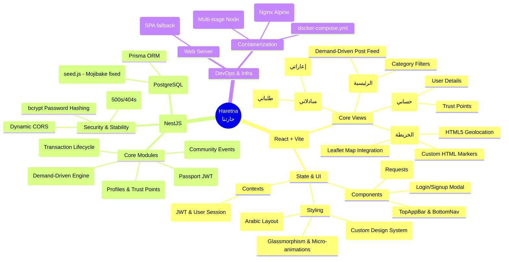

# Haretna (حارتنا) - Project Architecture Mind Map

This mind map visualizes the complete architectural structure, features, and technology stack of the Haretna Capstone Project.

```mermaid
mindmap
  root((Haretna<br/>حارتنا))
    Frontend (React + Vite)
      Core Views
        HomeFeed (الرئيسية)
          Demand-Driven Post Feed
          Category Filters
        SearchView (الخريطة)
          Leaflet Map Integration
          HTML5 Geolocation
          Custom HTML Markers
        MySwapsView (مبادلاتي)
          My Requests (طلباتي)
          My Lends (إعاراتي)
        ProfileView (حسابي)
          Trust Points
          User Details
      State & UI
        Contexts
          AuthContext (JWT & User Session)
        Components
          TopAppBar & BottomNav
          Login/Signup Modal
          AddItem Modal (Requests)
        Styling
          Tailwind CSS (Custom Design System)
          RTL Native (Arabic Layout)
          Glassmorphism & Micro-animations
    Backend (NestJS)
      Core Modules
        Auth (Passport JWT)
        Users (Profiles & Trust Points)
        Posts (Demand-Driven Engine)
        Swaps (Transaction Lifecycle)
        Initiatives (Community Events)
      Security & Stability
        Global Exception Filter (500s/404s)
        Dynamic CORS
        bcrypt Password Hashing
      Database (PostgreSQL)
        Prisma ORM
        Seed Data (seed.js - Mojibake fixed)
    DevOps & Infra
      Containerization
        docker-compose.yml
        backend/Dockerfile (Multi-stage Node)
        frontend/Dockerfile (Nginx Alpine)
      Web Server
        Nginx Reverse Proxy (SPA fallback)
```
